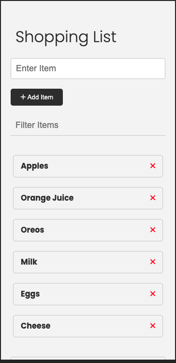
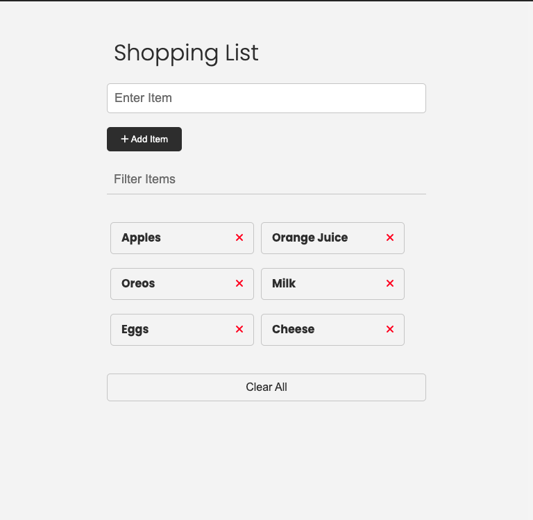

# Shopping List Web App

## Overview
This is a basic shopping list web app designed to help you keep track of your shopping needs. It allows you to add, edit, and remove items from your shopping list, ensuring you never forget what you need to buy.

## Features
- Add items to your shopping list with item names and quantities.
- Edit items to update their names or quantities.
- Remove items when you've purchased them or no longer need them.
- Clear the entire shopping list if you want to start fresh.

## Screenshots

## Getting Started
1. Clone or download the repository to your local machine.
2. Open the project in your favorite code editor.
3. Open the `index.html` file in a web browser to use the shopping list app.

## Usage
1. To add an item, simply type the item name and quantity in the input fields and click the "Add" button.
2. To edit an item, click the "Edit" button next to the item you want to modify, make your changes, and click the "Update" button.
3. To remove an item, click the "Delete" button next to the item you want to remove.
4. To clear the entire shopping list, click the "Clear All" button.

## Technologies Used
- HTML
- CSS
- JavaScript

## Contributing
Contributions are welcome! If you'd like to contribute to the development of this shopping list web app, please follow these steps:
1. Fork the repository.
2. Create a new branch for your feature or bug fix.
3. Make your changes and commit them with descriptive messages.
4. Push your branch to your fork.
5. Create a pull request to the main repository.

## License
This project is licensed under the MIT License. See the [LICENSE](LICENSE) file for more details.

## Contact
If you have any questions or suggestions, feel free to contact us at [your-email@example.com].

Happy shopping!
